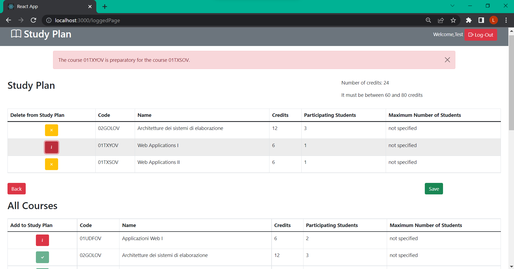

# Exam #1: "Piano di studi"
## Student: s303462 SCIARA LORENZO 

## React Client Application Routes

- Route `/`: Home page with the list of all the courses and their informations
- Route `/login`: Form for the login
- Route `/loggedPage`: Home page logged-in with all the courses and the study plan of the user 

## API Server
- GET `/api/courses`
  - No request parameters
  - It returns list of all the courses
- GET `/api/courseStudent/:coursecode`
  - It requires the code of the course for which to calculate the number of students 
  - It returns the number of students enrolled in the course
- GET `/api/studyPlan`
  - It requires the user id of the study plan 
  - It returns the study plan of the user id
- POST `/api/studyPlan`
  - It requires the elements to add in the study plan in the body request 
  - No response
- GET `/api/studyPlan/:coursecode`
  - It requires the code of the course of the study plan
  - It returns the study plan element of the required course
- DELETE `/api/studyPlan/:cursecode`
  - It requires the code of the course of the study plan to delete
  - No response 
- DELETE `/api/studyPlan/:cursecode`
  - It requires the user id of the study plan to delete
  - No response 
- POST `/api/sessions`
  - It require the user information for the login 
  - It returns the user of the login
- POST `/api/sessions/current`
  - It require the user information for the logout 
  - No response
- GET `/api/sessions/current`
  - It requires the user to check
  - No response

## Database Tables

- Table `course` - contains coursecode (primary key) name credits maxstudents incompatibility prerequisites
- Table `studyplan` - contains coursecode (foregn key) userid (foregn key) type
- Table `user` - contains userid email name hash salt

## Main React Components

- `CoursesListTable` (in `courseList.js`): It prints a table with some courses (both for the All Courses and the course of the study plan); it requires the list that to be printed
- `HomePage` (in `homePage.js`): It is the page where the list of all courses is shown before login
- `LoggedInPage` (in `loggedInPage.js`): It is the page that is shown after login; shows any study plan (if already created) and the list of all courses
- `StudyPlan` (in `studyPlan.js`): It is the element that shows the list of study plans if it exists; it is shown only if the study plan already exists
- `CreateStudyPlan` (in `studyPlan.js`): It is the element that shows the form for creating the study plan and is shown if the study plan does not exist

(only _main_ components, minor ones may be skipped)

## Screenshot

## Users Credentials

- john.doe@polito.it, password
- mario.rossi@polito.it, password
- testuser@polito.it, password
- maria.rosa@polito.it, password
- luca.verdi@polito.it, password
